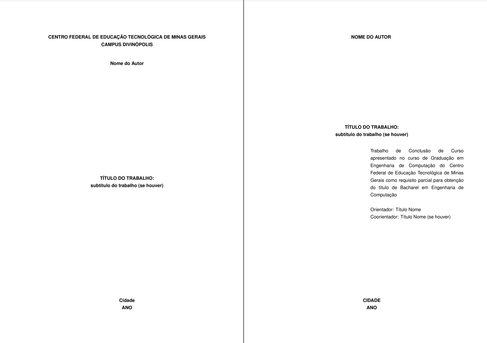

# Template CEFET-MG



Esse repositório consiste no template latex que atende as normas oficiais da [Biblioteca Universitária](https://www.bu.cefetmg.br/wp-content-uploads-sites-181-2023-04-manual-de-normalizacao-do-cefet-mg-pdf/) do CEFET.

## Execução

### Overleaf
Basta duplicar o projeto neste [link](https://www.overleaf.com/read/dtjckhkgjtqk) ou baixar o zip do repositório e subir para o Overleaf.

### Local
Para utilizar localmente, verifique-se possui o pacote `texlive-full` instalado no seu sistema derivado do [Debian](https://www.debian.org/), ou o equivalente em outros sistemas operacionais. 

#### Clone o repositório e os submodules
```
git clone --recurse-submodules git@github.com:lucasmsoares96/Template-Monografia-CEFET-MG.git  
```

#### Visual Studio Code
Recomenda-se a extensão [LaTeX Workshop](https://marketplace.visualstudio.com/items?itemName=James-Yu.latex-workshop) juntamente com a [Code Spell Checker](https://marketplace.visualstudio.com/items?itemName=streetsidesoftware.code-spell-checker-portuguese-brazilian) para o [Visual Studio Code](https://code.visualstudio.com/) com a seguinte configuração.

```
"latex-workshop.latex.outDir": "./.out/", 
```
para não poluir o diretório raiz.

#### Manualmente
Como esse projeto foi configurado pelo [latexmk](https://ctan.org/pkg/latexmk?lang%253Den) de forma a manter a compatibilidade total com o Overleaf, basta executar o seguinte comando no terminal:

```
latexmk -pdf -output-directory=out main.tex
```

## Customização
Esse pacote pode ser customizado passando argumentos da seguinte forma:
```latex
\usepackage[acronym, glossaries, index, labelref, debug]{CEFET}
```

- **acronym:** adiciona o suporte para lista de abreviaturas e siglas;
- **glossaries:** adiciona o suporte para glossário;
- **index:** adiciona o suporte para índice de assunto;
- **labelref:** `\ref{fig:1}` retorna `Figura 1` em vez de `1` para todas as referências;
- **debug:** Ativa as réguas e os quadros para melhorar a visualização das medidas.